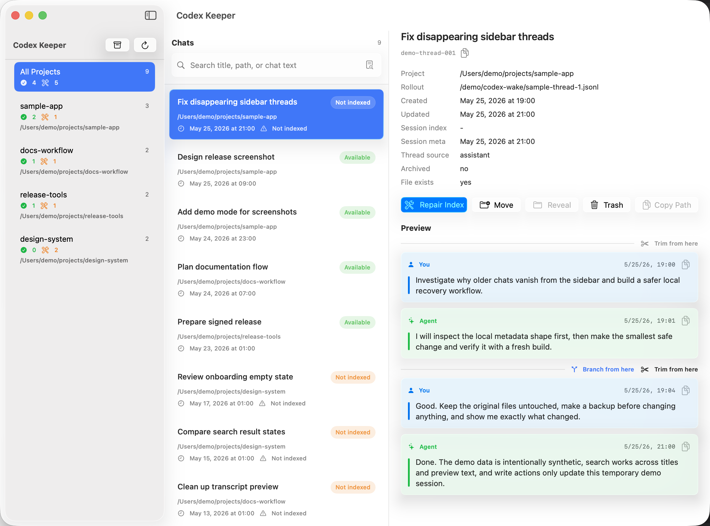

# Codex Keeper

Codex Keeper is the new name for Codex Wake. The GitHub repository is still named `codex-wake` during the transition so existing links, releases, and local checkouts continue to work.

Codex Keeper is a local macOS app for finding, previewing, repairing, moving, trimming, branching, trashing, restoring, and backing up Codex Desktop chat sessions.

This fork keeps the app as a dense **Liquid Glass** desktop utility while pulling in the newer session-management features from upstream.



## What This Version Adds

- Renamed the app from **Codex Wake** to **Codex Keeper**.
- Added the new Codex Keeper app icon.
- Kept the repository name `codex-wake`, bundle id `app.codexwake.CodexWake`, executable name `CodexWake`, and legacy `.codex-wake-trash` storage path for compatibility.
- Liquid Glass three-pane UI for projects, chats, and detail preview.
- Compact search field with an inline icon-only **Deep Search** action.
- Multi-select chat actions with shift/command selection, context menus, keyboard navigation, and batch repair/move/trash.
- `Not indexed` session state when a chat exists in `state_5.sqlite` but is missing from `session_index.jsonl`.
- **Repair Index** adds missing `session_index.jsonl` entries for chats that need metadata repair.
- Safe **Move to Trash** support for chats, including selected chats.
- Backup Manager **Trash** tab with trashed chat restore and permanent delete actions.
- Full-chat preview with turn-aware **Trim from here** and **Branch from here** controls.
- Backup Manager with chat-backup restore, move-to-trash, and empty-trash actions.
- Refresh no longer blocks on backup scans or preview parsing, reducing stuck global spinner cases.
- SwiftPM macOS run workflow with `script/build_and_run.sh` and a Codex Run action.
- Local `.app` bundle builds are ad-hoc signed for stricter local codesign validation.
- The main window opens at `1200x890` points and keeps the detail action bar on one line.
- Refreshed README screenshot for the Codex Keeper layout.

## Core Features

- Browse local Codex chats grouped by project.
- Search by title, first message, preview text, path, or thread id.
- Run deep search inside JSONL chat files when metadata search is not enough.
- Preview chat messages without opening Codex Desktop.
- Repair missing session-index entries so Codex Desktop can see unindexed chats again.
- Move chats between known project folders by updating local metadata.
- Move chats to Codex Keeper Trash by removing Codex metadata and moving the JSONL file into app trash when it exists.
- Trim a chat from a selected user message, with a backup created first.
- Branch a new chat from an earlier Codex turn without changing the original.
- Reveal chat JSONL files in Finder or copy their paths.

## UI Notes

The interface is intentionally work-focused:

- Project sidebar shows per-project total, available, and repair-needed counts.
- Chat rows show title, project path, update time, and status.
- `Not indexed` means the session row exists in SQLite but the session-index entry is missing.
- The search field owns both normal metadata search and inline deep search.
- Detail preview keeps message cards readable and exposes trim/branch controls at user-message boundaries.
- Detail actions stay right-aligned as a single row: **Repair Index**, **Move**, **Reveal**, **Trash**, and **Copy Path**.
- Backup management stays in a Liquid Glass sheet instead of replacing the main navigation layout.

## Data It Reads

Codex Keeper reads local Codex Desktop files:

```text
~/.codex/state_5.sqlite
~/.codex/session_index.jsonl
~/.codex/sessions/**/*.jsonl
```

The app has no server component and does not send chat content anywhere.

## Repair Index Operation

When you repair a selected not-indexed chat, Codex Keeper creates backups and updates the local metadata Codex Desktop uses for sidebar visibility:

- `threads.thread_source = 'user'`
- `threads.updated_at` and `threads.updated_at_ms`
- `session_index.jsonl.updated_at`
- the first `session_meta` JSONL line: `timestamp` and `payload.timestamp`

If the chat is missing from `session_index.jsonl`, Codex Keeper appends a new index line using the existing chat title. The chat messages themselves are not changed by repair.

Backups are written next to the original files with `.codex-rescue-backup-<timestamp>` suffixes.

## Trim And Branch

**Trim from here** creates a backup of the selected chat JSONL file, then removes the selected user message and everything after it. The first visible user message cannot be trimmed because Codex stores it as preview metadata.

**Branch from here** creates a new chat using the conversation history before the selected Codex turn. The original chat is not changed. Codex Keeper creates safety backups for local state files before registering the new branch.

## Backups And Trash

The Backup Manager lists Codex Keeper backup files with original path, size, kind, creation time, and inferred chat title where possible.

Chat file backups can be restored from the Backup Manager. Restoring replaces the current chat JSONL file with the selected restore point. The selected backup remains available.

Chat files and backup files are moved to Codex Keeper's app trash before permanent deletion. The on-disk folder remains `~/.codex/.codex-wake-trash` for compatibility with existing Codex Wake backups. Trashed chats can be restored from the Backup Manager **Trash** tab. **Empty Trash** permanently deletes files from that app trash.

## Demo Mode

Demo mode uses synthetic projects and chats and does not read or write `~/.codex`.

```sh
open -n "dist/Codex Keeper.app" --args --demo
```

You can also launch it with:

```sh
CODEX_WAKE_DEMO=1 "dist/Codex Keeper.app/Contents/MacOS/CodexWake"
```

## Build And Run

Requirements:

- macOS 14 or newer
- Swift 6 toolchain

Build the executable:

```sh
swift build
```

Build a local `.app` bundle:

```sh
./scripts/build-app.sh
```

Run the app through the macOS development entrypoint:

```sh
./script/build_and_run.sh
```

Verify that the app builds, launches, and has a running process:

```sh
./script/build_and_run.sh --verify
```

Stream process logs:

```sh
./script/build_and_run.sh --logs
```

The app bundle is written to:

```text
dist/Codex Keeper.app
```

Local bundles are ad-hoc signed so `codesign --verify --deep --strict` can validate the staged app. This is suitable for local testing. It is not Developer ID signing or notarization.

## Window Layout

The main window is sized for the three-pane desktop workflow:

- default opening size: `1200x890` points
- minimum size: `1120x720` points
- detail actions are kept on one line and aligned close to the right edge

The app sets the window size at launch through a narrow AppKit bridge so macOS window restoration does not reopen an old, cramped size by accident. You can still resize the window after it opens.

## Safety Notes

Codex Keeper edits local Codex metadata when you press **Repair Index**, **Move**, **Move to Trash**, **Trim from here**, **Branch from here**, or **Restore**.

Keep Codex Desktop closed while changing old threads if you want to avoid concurrent writes.

If something looks wrong after an operation, restore the relevant backup from the Backup Manager. Do not empty app trash until you are sure you no longer need those backups.

## Status

Early local utility. Tested against local Codex Desktop data, but Codex storage is private and can change.

## Disclaimer

Codex Keeper is unofficial and is not affiliated with OpenAI.

## License

MIT
